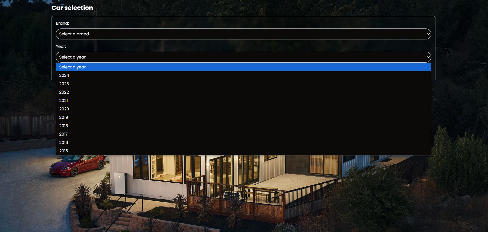

# Car Dealer App 🚗
This project is a Next.js application designed for selecting vehicles based on make and model year. The application features a filter page for selecting vehicle makes and a results page displaying the corresponding vehicle models. With an emphasis on user experience, it uses Tailwind CSS for styling.

  

## 🚗 Features:
1. Filter Page:
- Serves as the home page, allowing users to select vehicle makes and model years.
- Utilizes Tailwind CSS for a modern and responsive design.
2. Dynamic Selectors:
- Fetches vehicle makes from the National Highway Traffic Safety Administration (NHTSA) API.
- Allows users to select model years from 2015 to the current year.
3. Navigation:
- Features a "Next" button that is enabled only when both vehicle type and model year are selected, ensuring a smooth user experience.
4. Result Page:
- Displays vehicle models based on the selected make and year, fetched from the NHTSA API.
5. Loading States:
- Uses React's Suspense component to manage loading states and enhance user experience.
6. Responsive Design:
- All components and pages are styled with Tailwind CSS, following best practices for responsive design and accessibility.

## 🛠️ Technologies Used:
- Next.js: For building the server-rendered React application.
- Tailwind CSS: For styling the application with a utility-first approach.
- React: For creating interactive UI components.
- VPIC API: Utilized for fetching vehicle makes and models.
- ESLint & Prettier: To maintain code quality and consistency throughout the project.

## 🚀 How to Run the Project:
1. Clone the repository.
2. Navigate to the project directory.
3. Install dependencies:
 - npm install
4. Run the development server:
 - npm run dev
This will launch the project locally at http://localhost:3000.

## 👾 Demo:
Check out the live demo [here](https://car-dealer-opal.vercel.app/).
